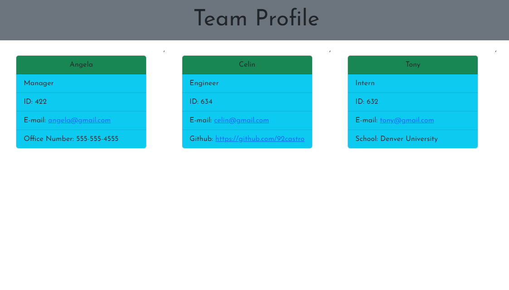

# Team-Profile-Generator

## Description

My task was to built an app for a manager who wants to generates a webpage with a team and the team's info. The manager starts by running node.js and is prompted to provide their name, ID, e-mail, and office number. When thats completed, the manager is presented to add an Engineer or an Intern to continue building the team. When Engineer is selected, they're asked to provide the engineer's name, ID, email, and Github url. When Intern is selected, they're asked to provide the intern's name, ID, e-mail, and the school they attended to. When the manager has completed building their team, they can select the "Finish building team" option and their webpage will be generated in a HTML file.

## Installation

User must have Node.js installed, as well as Inquirer 8.2.4

## User Story

AS A manager
I WANT to generate a webpage that displays my team's basic info
SO THAT I have quick access to their emails and GitHub profiles

## Acceptance Criteria

GIVEN a command-line application that accepts user input
WHEN I am prompted for my team members and their information
THEN an HTML file is generated that displays a nicely formatted team roster based on user input
WHEN I click on an email address in the HTML
THEN my default email program opens and populates the TO field of the email with the address
WHEN I click on the GitHub username
THEN that GitHub profile opens in a new tab
WHEN I start the application
THEN I am prompted to enter the team manager’s name, employee ID, email address, and office number
WHEN I enter the team manager’s name, employee ID, email address, and office number
THEN I am presented with a menu with the option to add an engineer or an intern or to finish building my team
WHEN I select the engineer option
THEN I am prompted to enter the engineer’s name, ID, email, and GitHub username, and I am taken back to the menu
WHEN I select the intern option
THEN I am prompted to enter the intern’s name, ID, email, and school, and I am taken back to the menu
WHEN I decide to finish building my team
THEN I exit the application, and the HTML is generated

## Review

Repository Page

- https://github.com/92castro/team-profile-generator

Video Link

- https://drive.google.com/file/d/1Z1OIOJU-NV1oEfRZMuhJJxvHAUQfIrr7/view

